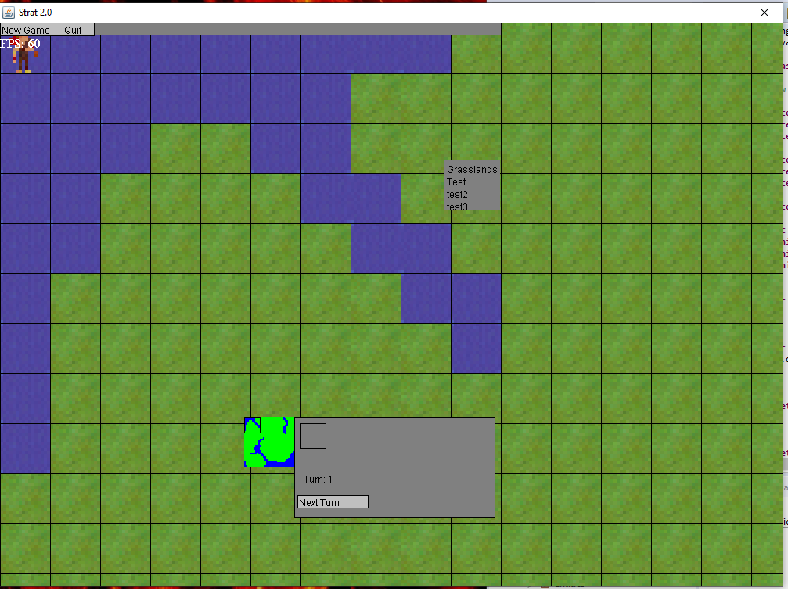
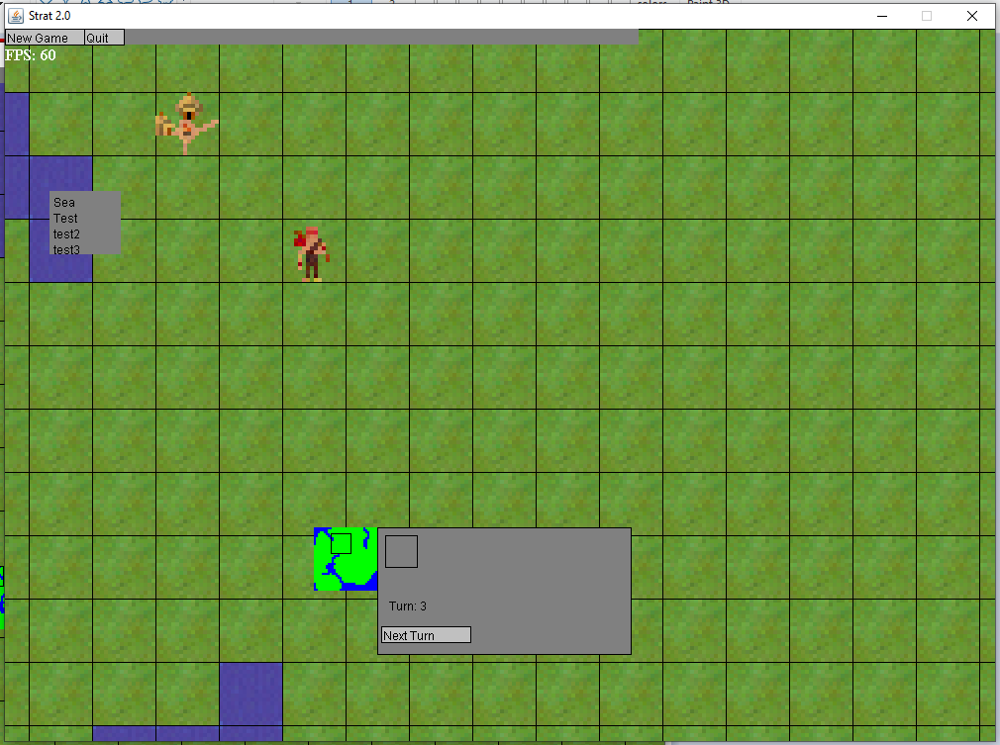

# JavaTurnStratGame
A turn-based strategy game build in Java using Swing and AWT. The game is rendered on a Java AWT canvas and is updated 60 times a second on a thread separate from the main window thread. Images are loaded from Sheet.png Spritesheet and the map is generated from a PNG where each pixel color represents a particular terrain.

Inspired by Sid Meier's Civilization game series. In this game, the user can move the camera around with the arrow keys to pan the map, hover the mouse over tiles to see details as the tile, select a unit and move them once per turn, go to next turn and build huts with the settler unit.

The game is still in its earlier iteration. New planned features include more units such as ships, more terrain tiles such as deserts, more structures to build, resources to gather, allow saving and loading maps, AI to play against, and sounds.
